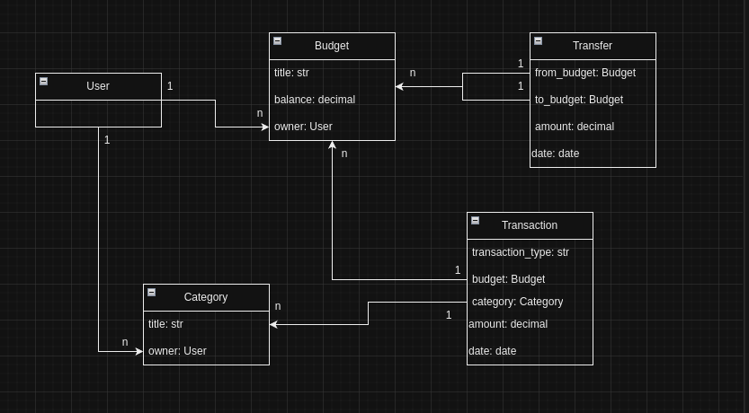

# budget-tracker

Django project for keeping track of expenses, income, and other
financial transactions in order to ensure that the budget is being
used efficiently and effectively

## Installation

1. Clone the repo:
    ```shell
    git clone https://github.com/y-kondrashova/budget-tracker.git
    ```
2. Change working directory:
    ```shell
   cd budget-tracker
   ```
3. Create virtual environment:
   ```shell
    python3 -m venv venv
    ```
4. Activate virtual environment:
    ```shell
    source venv/bin/activate
    ```
5. Install requirements:
   ```shell
   pip install -r requirements.txt
   ```
6. Run migrations:
   ```shell
   python manage.py migrate
   ```
7. Run server:
   ```shell
   python manage.py runserver
   ```
   
## DB schema


   
## Demo

Check demo-version here:

https://budget-tracker-os6u.onrender.com

### Credentials for test-user:

username: alice

password: 123alise123

## Features

* Authentication functionality for User
* Managing budgets
* Managing transaction
* Managing transfers
